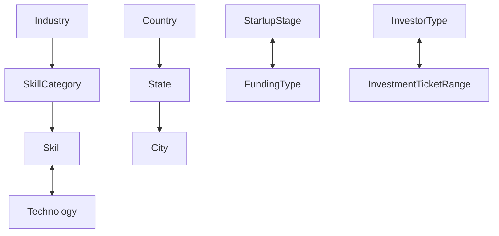

# Master Data Relationship Hierarchy Matrix

## Relational Key Mappings
- `SkillCategory.industryId` $\rightarrow$ `Industry.id` (Foreign key with `onDelete: SetNull`)
- `Skill.categoryId` $\rightarrow$ `SkillCategory.id` (Foreign key with `onDelete: SetNull`)
- `User.countryId` $\rightarrow$ `Country.id`
- `FreelancerSkill.skillId` $\rightarrow$ `Skill.id` (Composite key)
- `InvestorPreferredIndustry.industryId` $\rightarrow$ `Industry.id`
