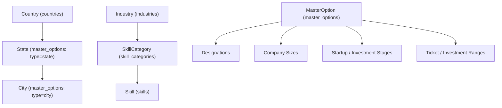

# Master Data Relationship & Hierarchy Report

This report outlines the structural relationships and foreign key mappings established across the master data models.

## Foreign Key & Association Mapping

1. **`Skill` $\rightarrow$ `SkillCategory` (`categoryId`):**
   - Foreign key constraint `skills_category_id_fkey` with `onDelete: SetNull`.
   - All 290 skills are assigned to their respective 71 skill categories.

2. **`SkillCategory` $\rightarrow$ `Industry` (`industryId`):**
   - Foreign key constraint `skill_categories_industry_id_fkey`.
   - Links skill categories to major industry sectors.

3. **`MasterOption` Hierarchies:**
   - Grouping via `groupKey` enables hierarchical relationships (e.g. Designations grouped by Category: "Leadership", "Engineering", "AI & Data", "Product", "Marketing", "Sales", "Finance", "Legal", "HR").
